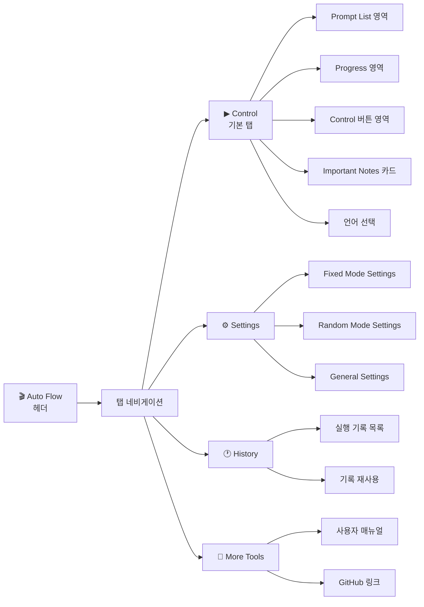
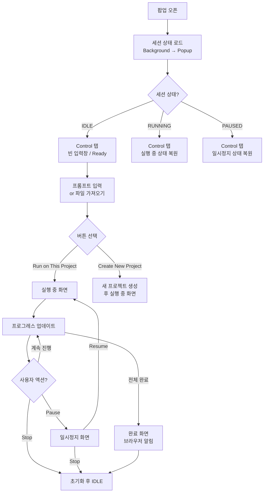
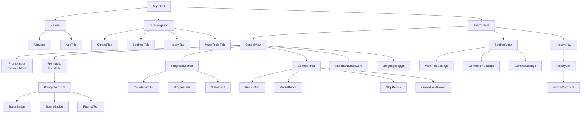
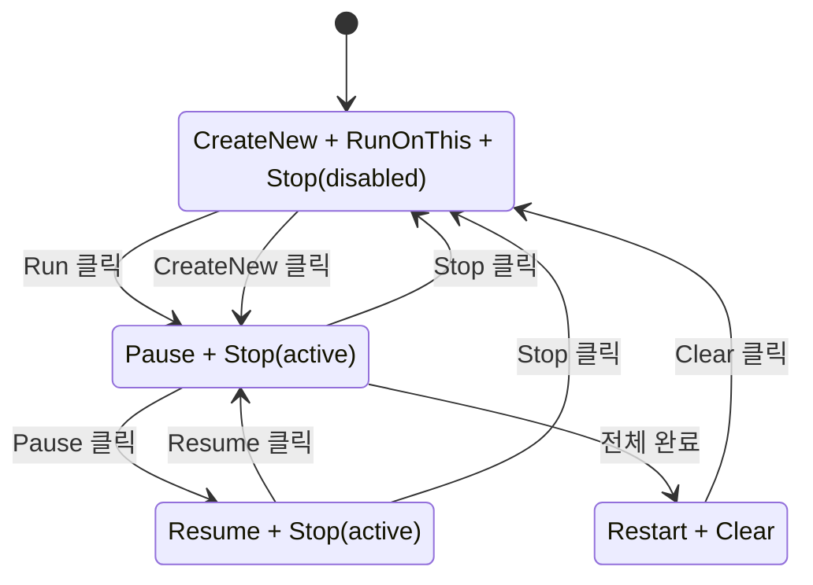
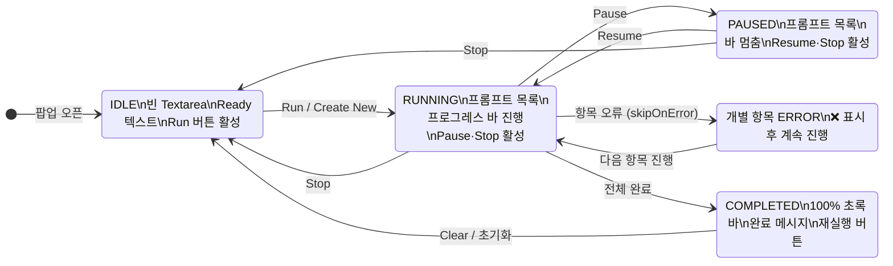
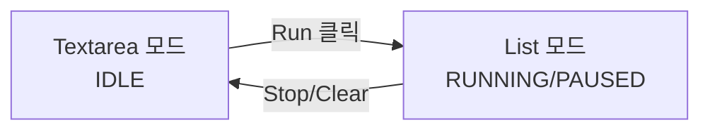
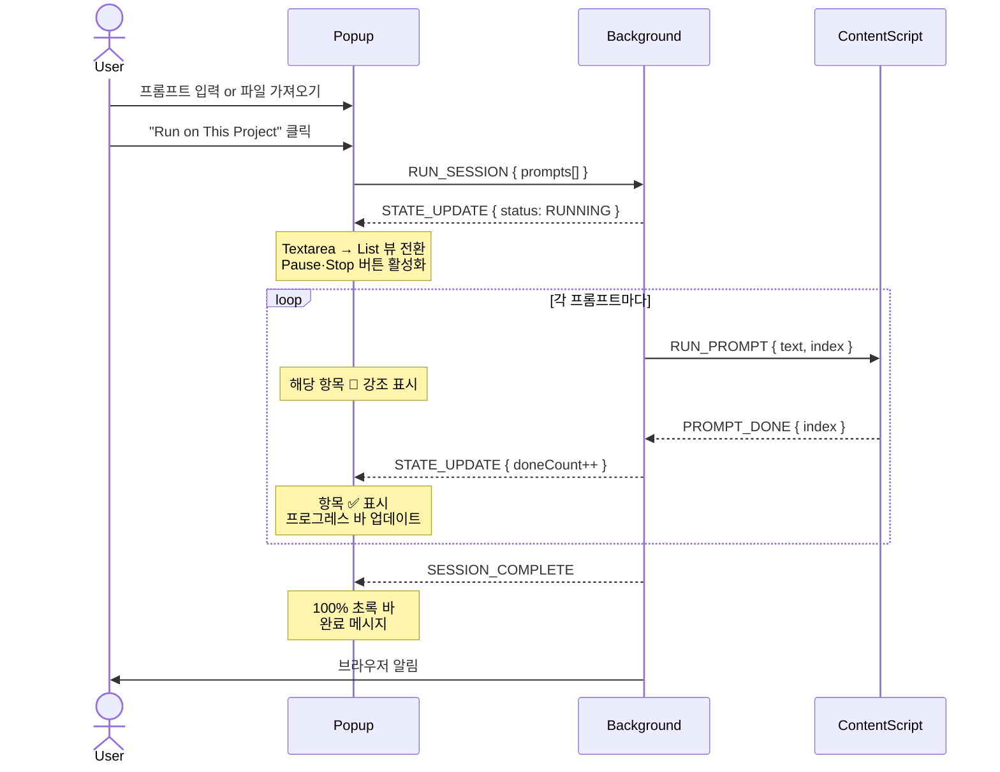
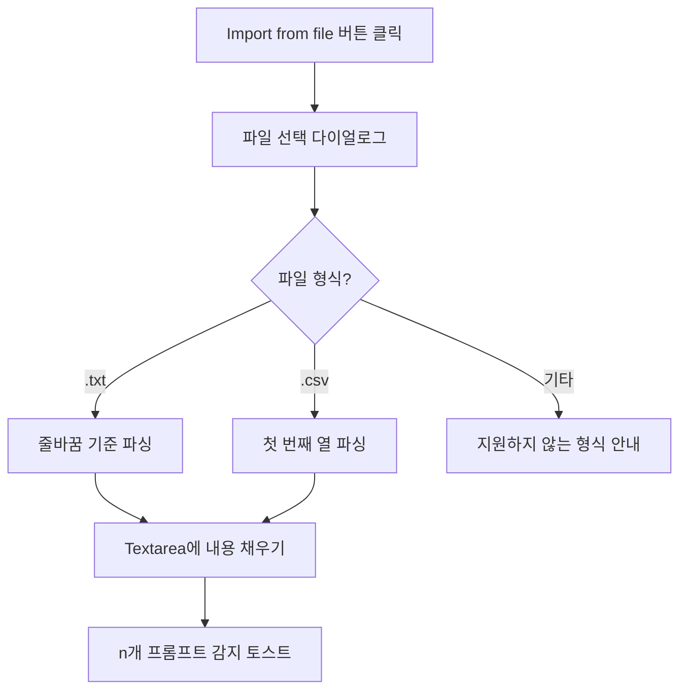

# UI/UX 디자인 문서: Auto Flow Chrome Extension

**문서 버전**: 1.0
**작성일**: 2026-03-29
**참조**: [PRD.md](./PRD.md) | [ARCHITECTURE.md](./ARCHITECTURE.md)
**디자인 레퍼런스**: Auto Whisk Chrome Extension

---

## 목차

1. [디자인 컨셉](#1-디자인-컨셉)
2. [디자인 시스템](#2-디자인-시스템)
3. [화면 구조 및 내비게이션](#3-화면-구조-및-내비게이션)
4. [화면별 상세 설계](#4-화면별-상세-설계)
5. [컴포넌트 설계](#5-컴포넌트-설계)
6. [상태별 UI 변화](#6-상태별-ui-변화)
7. [인터랙션 설계](#7-인터랙션-설계)
8. [반응형 및 접근성](#8-반응형-및-접근성)

---

## 1. 디자인 컨셉

### 1.1 디자인 방향

Auto Whisk의 **Dark Space 테마**를 계승하되, Google Flow의 브랜드 컬러(파란 계열)를 포인트로 결합한다.
창작 작업을 돕는 도구답게 **전문적이면서도 직관적인** UI를 지향한다.

| 속성 | 방향 |
|------|------|
| **무드** | Dark, 집중형, 우주/심야 작업실 분위기 |
| **포인트 컬러** | Google Flow 블루(#4A90D9) + 액센트 오렌지(#F5A623) |
| **복잡도** | 최소화 — 핵심 기능이 한눈에 보이는 단순한 레이아웃 |
| **폰트** | 시스템 폰트 우선 (Inter, -apple-system) |

### 1.2 레퍼런스 분석 (Auto Whisk)

Auto Whisk에서 계승할 요소:

| 요소 | Auto Whisk | Auto Flow 적용 |
|------|-----------|--------------|
| 배경 | 다크 네이비 + 별 파티클 효과 | 동일 적용 |
| 탭 네비게이션 | 오렌지 언더라인 활성 표시 | 동일 적용 |
| 섹션 헤더 | 하늘색(Cyan) 텍스트 | 동일 적용 |
| 버튼 스타일 | Start(파란색) / Stop(적갈색) | Run(파란색) / Stop(적갈색) |
| 안내 카드 | 황색 전구 아이콘 + 다크 카드 | 동일 적용 |
| 진행 표시 | 흰색 progress bar + 상태 텍스트 | 번호 카운터 추가 |
| 파일 가져오기 | 우측 상단 버튼 | 동일 위치 |

Auto Flow에서 추가할 요소:

- 프롬프트별 **상태 아이콘 배지** (⏳ / 🔄 / ✅ / ❌)
- **씬 번호 뱃지** 자동 표시
- **n / total 숫자 카운터** (프로그레스 바 위)
- **Pause / Resume** 버튼 (실행 중 상태)

---

## 2. 디자인 시스템

### 2.1 컬러 팔레트

```css
:root {
  /* === 배경 === */
  --color-bg-primary:     #0D1117;  /* 메인 배경 - 딥 네이비 */
  --color-bg-secondary:   #161B22;  /* 카드·입력창 배경 */
  --color-bg-tertiary:    #21262D;  /* 버튼·태그 배경 */
  --color-bg-overlay:     #1C2128;  /* 모달 오버레이 */

  /* === 포인트 컬러 === */
  --color-accent-orange:  #F5A623;  /* 활성 탭, 중요 텍스트 (Auto Whisk 계승) */
  --color-accent-blue:    #4A90D9;  /* Run 버튼, 섹션 헤더, Flow 브랜드 */
  --color-accent-cyan:    #58C4DC;  /* 섹션 제목, 링크 */

  /* === 상태 컬러 === */
  --color-status-pending: #8B949E;  /* ⏳ 회색 - 대기 중 */
  --color-status-running: #F5A623;  /* 🔄 오렌지 - 실행 중 */
  --color-status-done:    #3FB950;  /* ✅ 초록 - 완료 */
  --color-status-error:   #F85149;  /* ❌ 빨강 - 오류 */

  /* === 버튼 컬러 === */
  --color-btn-run:        #4A90D9;  /* Run / Resume 버튼 */
  --color-btn-run-hover:  #5A9FE8;
  --color-btn-stop:       #8B3A3A;  /* Stop 버튼 */
  --color-btn-stop-hover: #A04444;
  --color-btn-pause:      #4A4A6A;  /* Pause 버튼 */
  --color-btn-secondary:  #21262D;  /* 보조 버튼 (Create New, Import) */

  /* === 텍스트 === */
  --color-text-primary:   #E6EDF3;  /* 주요 텍스트 */
  --color-text-secondary: #8B949E;  /* 보조 텍스트, placeholder */
  --color-text-note:      #F5A623;  /* Important Notes 텍스트 */

  /* === 테두리 === */
  --color-border-default: #30363D;  /* 기본 구분선 */
  --color-border-focus:   #4A90D9;  /* 입력창 포커스 */
  --color-border-active:  #F5A623;  /* 활성 탭 언더라인 */
}
```

### 2.2 타이포그래피

```css
:root {
  --font-family: 'Inter', -apple-system, BlinkMacSystemFont,
                 'Segoe UI', sans-serif;

  /* 폰트 크기 */
  --font-size-xs:   11px;  /* 상태 뱃지 */
  --font-size-sm:   12px;  /* 보조 텍스트, 메타 정보 */
  --font-size-base: 13px;  /* 본문, 버튼 */
  --font-size-md:   14px;  /* 섹션 헤더 */
  --font-size-lg:   16px;  /* 탭 레이블 */
  --font-size-xl:   20px;  /* 앱 타이틀 */

  /* 폰트 굵기 */
  --font-weight-normal:    400;
  --font-weight-medium:    500;
  --font-weight-semibold:  600;
  --font-weight-bold:      700;
}
```

### 2.3 간격 시스템

```css
:root {
  --space-1:   4px;
  --space-2:   8px;
  --space-3:  12px;
  --space-4:  16px;
  --space-5:  20px;
  --space-6:  24px;
  --space-8:  32px;
}
```

### 2.4 모서리 반경

```css
:root {
  --radius-sm:   4px;   /* 작은 뱃지, 태그 */
  --radius-md:   8px;   /* 버튼, 입력창 */
  --radius-lg:  12px;   /* 카드, 모달 */
  --radius-full: 9999px; /* 토글, pill 뱃지 */
}
```

### 2.5 팝업 고정 크기

```css
/* popup/styles/popup.css */
body {
  width:  400px;
  min-height: 580px;
  max-height: 700px;
  overflow-y: auto;
}
```

---

## 3. 화면 구조 및 내비게이션

### 3.1 탭 네비게이션 구조



### 3.2 전체 화면 플로우



---

## 4. 화면별 상세 설계

### 4.1 공통 헤더

Auto Whisk와 동일한 구조. 로고·앱명·탭을 고정 배치.

```
┌────────────────────────────────────────┐
│  🏠  [🌊 아이콘]  Auto Flow             │  ← 배경: #161B22
│           Google Flow Automator        │
├────────────────────────────────────────┤
│  ▶ Control  ⚙ Settings  🕐 History  🔧 │  ← 탭바: 배경 #0D1117
│  ━━━━━━━━                              │  ← 활성 탭 오렌지 언더라인
└────────────────────────────────────────┘
```

| 요소 | 스펙 |
|------|------|
| 헤더 배경 | `#161B22`, 하단 border `#30363D` |
| 앱 아이콘 | 48×48px, border-radius 10px |
| 앱 타이틀 | `font-size: 20px`, `font-weight: 700`, 흰색 |
| 서브타이틀 | `font-size: 11px`, `#8B949E` |
| 탭 레이블 | `font-size: 13px`, 비활성 `#8B949E`, 활성 `#F5A623` |
| 활성 탭 언더라인 | `height: 2px`, `background: #F5A623` |
| 탭 바 배경 | `#0D1117` |

---

### 4.2 Control 탭 — IDLE 상태

```
┌────────────────────────────────────────┐  ← #0D1117 배경 + 파티클 효과
│                                        │
│  Prompt List          [📄 Import (.txt)]│  ← 섹션헤더 #58C4DC, 버튼 #21262D
│  ────────────────────────────────────  │
│  ┌──────────────────────────────────┐  │
│  │                                  │  │  ← textarea
│  │  씬번호별로 한 줄씩 입력하세요...  │  │    배경: #161B22
│  │                                  │  │    border: #30363D
│  │                                  │  │    focus-border: #4A90D9
│  │                                  │  │    height: 220px
│  │                                  │  │    border-radius: 8px
│  └──────────────────────────────────┘  │
│                                        │
│  ┌──────────────────────────────────┐  │
│  │ ━━━━━━━━━━━━━━━━━━━━━━━━━━━━━━━ │  │  ← progress bar (흰색 track)
│  │ Ready                            │  │  ← 상태 텍스트 #8B949E
│  └──────────────────────────────────┘  │
│                                        │
│  [🚀 Create New Project            ]   │  ← 보조 버튼 #21262D, 전체 너비
│  [▶ Run on This Project            ]   │  ← 보조 버튼 #21262D, 전체 너비
│                             [■ Stop]   │  ← Stop 버튼 #8B3A3A, 비활성(opacity 0.5)
│                                        │
│  ┌──────────────────────────────────┐  │
│  │ 💡 Important Notes:              │  │  ← 카드: #161B22, border: #30363D
│  │  - Flow 탭과 이 패널을 열어 두세요│  │    아이콘: #F5A623
│  │  - 별도 창에서 실행하면 안정적  │  │    텍스트: #E6EDF3, 강조: bold
│  └──────────────────────────────────┘  │
│                                        │
│  사용자 매뉴얼 / User Manual           │  ← #58C4DC
│  ──────────────────────────────────── │
│         [한국어]      [English]         │  ← 언어 토글 버튼
└────────────────────────────────────────┘
```

---

### 4.3 Control 탭 — RUNNING 상태

```
┌────────────────────────────────────────┐
│  Prompt List          [📄 Import (.txt)]│
│  ────────────────────────────────────  │
│  ┌──────────────────────────────────┐  │
│  │ ✅ [씬01] Wide establishing...   │  │  ← 완료: #3FB950 아이콘
│  │ 🔄 [씬02] Close-up portrait...  │  │  ← 실행중: #F5A623 + 좌측 바 강조
│  │ ⏳ [씬03] Aerial drone view...  │  │  ← 대기: #8B949E
│  │ ⏳ [씬04] Interior shot with... │  │  ← 스크롤 가능
│  │ ⏳ [씬05] ...                   │  │
│  └──────────────────────────────────┘  │  ← 목록 모드(실행 중)로 전환
│                                        │
│  2 / 10                         20%    │  ← 카운터 텍스트 + 퍼센트
│  ┌──────────────────────────────────┐  │
│  │ ████████░░░░░░░░░░░░░░░░░░░░░░░ │  │  ← 파란 프로그레스 바
│  │ 🔄 씬02 생성 중...               │  │  ← 현재 상태 텍스트
│  └──────────────────────────────────┘  │
│                                        │
│  [⏸ Pause                    ][■ Stop] │  ← Pause(#4A4A6A) / Stop(#8B3A3A)
│                                        │
│  ┌──────────────────────────────────┐  │
│  │ 💡 Important Notes: ...         │  │
│  └──────────────────────────────────┘  │
└────────────────────────────────────────┘
```

**실행 중 상태 변화 상세:**

| 요소 | IDLE | RUNNING |
|------|------|---------|
| 입력 영역 | Textarea (편집 가능) | 프롬프트 목록 (읽기 전용) |
| 버튼 행 1 | Create New Project | — (숨김) |
| 버튼 행 2 | Run on This Project | Pause |
| Stop 버튼 | 비활성(opacity 0.4) | 활성 |
| 프로그레스 바 | 흰색 트랙, "Ready" | 파란색 채움, "씬N 생성 중..." |
| 카운터 | 미표시 | `n / total   n%` 표시 |

---

### 4.4 Control 탭 — PAUSED 상태

```
│  [▶ Resume                   ][■ Stop] │  ← Resume 버튼 파란색으로 활성화
│                                        │
│  ┌──────────────────────────────────┐  │
│  │ ⏸ ──────────────────────────── │  │  ← 프로그레스 바 멈춤(pause 색상)
│  │ 일시정지됨 (2 / 10 완료)         │  │
│  └──────────────────────────────────┘  │
```

---

### 4.5 Control 탭 — COMPLETED 상태

```
│  10 / 10                       100%   │
│  ┌──────────────────────────────────┐  │
│  │ ████████████████████████████████│  │  ← 초록 프로그레스 바 100%
│  │ ✅ 모든 이미지 생성 완료!         │  │  ← 초록 텍스트
│  └──────────────────────────────────┘  │
│                                        │
│  [🔄 다시 실행              ][🗑 초기화]│
```

---

### 4.6 Settings 탭

Auto Whisk Settings와 동일한 레이아웃 패턴 적용.

```
┌────────────────────────────────────────┐
│                                        │
│  ⏱ Wait Time Settings                 │  ← 섹션 헤더 #58C4DC
│  ──────────────────────────────────── │
│  고정 대기 시간 사용:  [☑]             │
│  대기 시간 (ms):      [  1000  ]       │
│                                        │
│  랜덤 대기 시간:       [ 500 ] ~ [2000]│
│                                        │
│  ⚙ Generation Settings                │  ← 섹션 헤더
│  ──────────────────────────────────── │
│  완료 감지 타임아웃(초): [  120  ]      │
│  최대 재시도 횟수:       [   3   ]      │
│  오류 시 건너뛰기:      [☑]            │
│                                        │
│  🌐 General Settings                  │  ← 섹션 헤더
│  ──────────────────────────────────── │
│  시작 프롬프트 번호:    [   1   ]       │
│  언어:                 [한국어    ▼]   │
│                                        │
│              [💾 설정 저장]             │
└────────────────────────────────────────┘
```

**설정 입력 컴포넌트 스펙:**

| 컴포넌트 | 스펙 |
|---------|------|
| 섹션 헤더 | `color: #58C4DC`, `font-size: 14px`, `font-weight: 600` |
| 구분선 | `border-bottom: 1px solid #30363D` |
| 레이블 | `color: #8B949E`, `font-size: 13px` |
| 숫자 입력 | 배경 `#21262D`, border `#30363D`, 텍스트 흰색, `width: 80px`, `border-radius: 6px`, `text-align: center` |
| 체크박스 | 기본 스타일, accent-color `#4A90D9` |
| 드롭다운 | 배경 `#21262D`, 전체 너비, `border-radius: 6px` |
| 저장 버튼 | `background: #4A90D9`, 전체 너비, `border-radius: 8px` |

---

### 4.7 History 탭

```
┌────────────────────────────────────────┐
│                                        │
│  실행 기록                    [🗑 전체삭제]│  ← 헤더
│  ──────────────────────────────────── │
│                                        │
│  ┌──────────────────────────────────┐  │
│  │ 📅 2026-03-29 19:25             │  │  ← 기록 카드
│  │ ✅ 20개 완료  ❌ 1개 오류        │  │
│  │ 씬01, 씬02, 씬03 ...            │  │  ← 프롬프트 미리보기(3개)
│  │                    [▶ 재사용]   │  │  ← 재사용 버튼
│  └──────────────────────────────────┘  │
│                                        │
│  ┌──────────────────────────────────┐  │
│  │ 📅 2026-03-28 14:10             │  │
│  │ ✅ 15개 완료  ❌ 0개 오류        │  │
│  │ Wide shot, Close-up ...         │  │
│  │                    [▶ 재사용]   │  │
│  └──────────────────────────────────┘  │
│                                        │
│  (기록 없음 시)                         │
│  ┌──────────────────────────────────┐  │
│  │  🕐 아직 실행 기록이 없습니다.    │  │  ← 빈 상태 메시지
│  └──────────────────────────────────┘  │
└────────────────────────────────────────┘
```

---

## 5. 컴포넌트 설계

### 5.1 컴포넌트 계층 구조



### 5.2 PromptItem 컴포넌트

실행 중에 Textarea → 목록 뷰로 전환. 각 항목의 상태를 시각적으로 구분.

```
┌────────────────────────────────────────┐
│ [🔄] [씬02]  Close-up portrait shot,  │  ← 실행 중 항목
│              warm lighting, bokeh...  │
│              ←── 좌측 강조 바(2px)    │
└────────────────────────────────────────┘
```

| 요소 | 스펙 |
|------|------|
| 좌측 강조 바(running) | `width: 3px`, `background: #F5A623`, `border-radius: 2px` |
| 상태 아이콘 | `font-size: 14px`, `min-width: 20px` |
| 씬 뱃지 | `background: #21262D`, `color: #58C4DC`, `font-size: 11px`, `border-radius: 4px`, `padding: 1px 6px` |
| 프롬프트 텍스트 | `font-size: 12px`, 2줄 말줄임(`-webkit-line-clamp: 2`) |
| 완료 항목 배경 | `rgba(63, 185, 80, 0.05)` |
| 오류 항목 배경 | `rgba(248, 81, 73, 0.05)` |
| 실행 중 배경 | `rgba(245, 166, 35, 0.08)` |
| 항목 높이 | `min-height: 52px` |
| 구분선 | `border-bottom: 1px solid #21262D` |

### 5.3 ProgressBar 컴포넌트

```
  2 / 10                           20%
  ┌──────────────────────────────────┐
  │ ██████░░░░░░░░░░░░░░░░░░░░░░░░░ │   ← 파란 채움 / 어두운 트랙
  └──────────────────────────────────┘
  🔄 씬02 생성 중...
```

| 요소 | 스펙 |
|------|------|
| 카운터 행 | `display: flex`, `justify-content: space-between` |
| 카운터 텍스트 | `font-size: 12px`, `color: #8B949E` |
| 퍼센트 텍스트 | `font-size: 12px`, `color: #E6EDF3`, `font-weight: 600` |
| 트랙 배경 | `background: #21262D`, `height: 6px`, `border-radius: 3px` |
| 채움 바(running) | `background: #4A90D9`, transition `width 0.4s ease` |
| 채움 바(done) | `background: #3FB950` |
| 채움 바(paused) | `background: #4A4A6A` |
| 상태 텍스트 | `font-size: 12px`, `color: #8B949E`, 상단 `4px` margin |

### 5.4 버튼 컴포넌트



**버튼 스펙:**

| 버튼 | 배경 | 텍스트색 | 너비 | 높이 |
|------|------|---------|------|------|
| Run on This Project | `#21262D` | `#E6EDF3` | 100% | 44px |
| Create New Project | `#21262D` | `#E6EDF3` | 100% | 44px |
| Pause | `#4A4A6A` | `#E6EDF3` | calc(100%-Stop너비-8px) | 44px |
| Resume | `#4A90D9` | `#FFFFFF` | calc(100%-Stop너비-8px) | 44px |
| Stop | `#8B3A3A` | `#E6EDF3` | 120px | 44px |
| 저장/확인 | `#4A90D9` | `#FFFFFF` | 100% | 40px |

**버튼 공통 스펙:**
- `border-radius: 8px`
- `font-size: 13px`, `font-weight: 600`
- `border: none`
- `cursor: pointer`
- `transition: background 0.2s, opacity 0.2s`
- 비활성: `opacity: 0.4`, `cursor: not-allowed`

### 5.5 ImportantNotes 카드

```css
.notes-card {
  background: #161B22;
  border: 1px solid #30363D;
  border-radius: 8px;
  padding: 12px 14px;
  display: flex;
  gap: 10px;
}
.notes-icon { color: #F5A623; font-size: 18px; }
.notes-title { color: #F5A623; font-weight: 700; font-size: 13px; }
.notes-text { color: #E6EDF3; font-size: 12px; line-height: 1.6; }
.notes-text strong { color: #E6EDF3; font-weight: 700; }
```

### 5.6 StatusBadge 컴포넌트

| 상태 | 아이콘 | 색상 | 애니메이션 |
|------|-------|------|----------|
| pending | ⏳ | `#8B949E` | 없음 |
| running | 🔄 | `#F5A623` | `spin 1s linear infinite` |
| done | ✅ | `#3FB950` | `fadeIn 0.3s` |
| error | ❌ | `#F85149` | `shake 0.3s` |

### 5.7 파티클 배경 효과

Auto Whisk와 동일한 별 파티클 배경.

```css
/* 별 파티클: CSS 또는 Canvas로 구현 */
.particle {
  position: absolute;
  width: 2px;
  height: 2px;
  background: rgba(255, 255, 255, 0.3);
  border-radius: 50%;
  animation: twinkle 3s infinite alternate;
}
@keyframes twinkle {
  0%   { opacity: 0.2; }
  100% { opacity: 0.8; }
}
```

---

## 6. 상태별 UI 변화

### 6.1 전체 상태 전환 다이어그램



### 6.2 프롬프트 입력 영역 — Textarea ↔ List 전환



- **Textarea 모드**: 사용자가 직접 프롬프트를 입력·편집
- **List 모드**: 파싱된 항목을 번호·상태와 함께 표시, 편집 불가

---

## 7. 인터랙션 설계

### 7.1 주요 인터랙션 흐름



### 7.2 파일 가져오기 인터랙션



### 7.3 애니메이션 스펙

| 대상 | 애니메이션 | 지속 시간 | 이징 |
|------|----------|---------|------|
| 탭 전환 | `opacity 0→1` | 150ms | `ease` |
| Textarea → List 전환 | `slideUp + fadeIn` | 250ms | `ease-out` |
| 프로그레스 바 채움 | `width` 변화 | 400ms | `ease` |
| 항목 완료(✅) | `scale 0.8→1 + fadeIn` | 200ms | `ease-out` |
| 오류 항목(❌) | `shake 3회` | 300ms | `linear` |
| 버튼 Hover | `background` 밝아짐 | 200ms | `ease` |
| 완료 시 바 | `background: #4A90D9 → #3FB950` | 600ms | `ease` |

---

## 8. 반응형 및 접근성

### 8.1 팝업 크기 고정

Chrome Extension Popup은 고정 크기로 동작.

```css
body {
  width: 400px;
  min-height: 560px;
  max-height: 680px;
  overflow-y: auto;
  overflow-x: hidden;
  scrollbar-width: thin;
  scrollbar-color: #30363D transparent;
}
```

프롬프트 목록이 많을 경우:
- 목록 영역에 `max-height: 260px; overflow-y: auto;` 적용
- 스크롤바 커스텀 스타일 적용

### 8.2 접근성 요구사항

| 항목 | 구현 방법 |
|------|---------|
| 버튼 키보드 접근 | `tab` 이동, `enter`/`space` 활성화 |
| 비활성 버튼 | `disabled` 속성 + `aria-disabled="true"` |
| 진행 상태 | `role="progressbar"`, `aria-valuenow`, `aria-valuemax` |
| 상태 텍스트 | `aria-live="polite"` 로 스크린리더 알림 |
| 아이콘 버튼 | `aria-label` 필수 지정 |
| 컬러 대비 | WCAG AA 기준 (4.5:1 이상) 준수 |
| 포커스 링 | `:focus-visible` 시 `outline: 2px solid #4A90D9` |

### 8.3 빈 상태(Empty State) 디자인

| 상황 | 표시 내용 |
|------|---------|
| 프롬프트 미입력 시 Run 클릭 | 입력창 테두리 빨간색 + "프롬프트를 입력해주세요" 토스트 |
| Flow 탭 없을 때 | "Google Flow 탭을 먼저 열어주세요" 안내 모달 |
| History 기록 없음 | "🕐 아직 실행 기록이 없습니다." 빈 상태 카드 |
| 파일 파싱 오류 | "파일을 읽을 수 없습니다. .txt 또는 .csv 파일을 선택해주세요." 토스트 |

### 8.4 토스트 알림 스펙

```css
.toast {
  position: fixed;
  bottom: 16px;
  left: 50%;
  transform: translateX(-50%);
  background: #21262D;
  border: 1px solid #30363D;
  border-radius: 8px;
  padding: 8px 16px;
  font-size: 12px;
  color: #E6EDF3;
  z-index: 9999;
  animation: slideUp 0.2s ease, fadeOut 0.3s ease 2.5s forwards;
}
.toast.success { border-left: 3px solid #3FB950; }
.toast.error   { border-left: 3px solid #F85149; }
.toast.info    { border-left: 3px solid #4A90D9; }
```

---

## 부록: 디자인 토큰 요약

```
배경 레이어
  bg-primary   #0D1117  ← 메인 배경
  bg-secondary #161B22  ← 카드, 입력창
  bg-tertiary  #21262D  ← 버튼, 배지

포인트
  orange  #F5A623  ← 활성 탭, 실행 중, 중요 텍스트
  blue    #4A90D9  ← Run 버튼, 프로그레스, Flow 브랜드
  cyan    #58C4DC  ← 섹션 헤더, 링크

상태
  done    #3FB950  ← 완료
  error   #F85149  ← 오류
  pending #8B949E  ← 대기

텍스트
  primary   #E6EDF3
  secondary #8B949E

팝업 크기  400 × 560~680px
버튼 높이  44px (메인) / 40px (보조)
radius     8px (버튼·카드) / 4px (뱃지)
```

---

*이 문서는 Auto Whisk 디자인을 레퍼런스로 Auto Flow에 맞게 재설계한 UI/UX 디자인 명세서입니다.*
*실제 구현 시 Google Flow 브랜드 가이드라인과 Chrome Web Store 정책을 추가로 검토하세요.*
